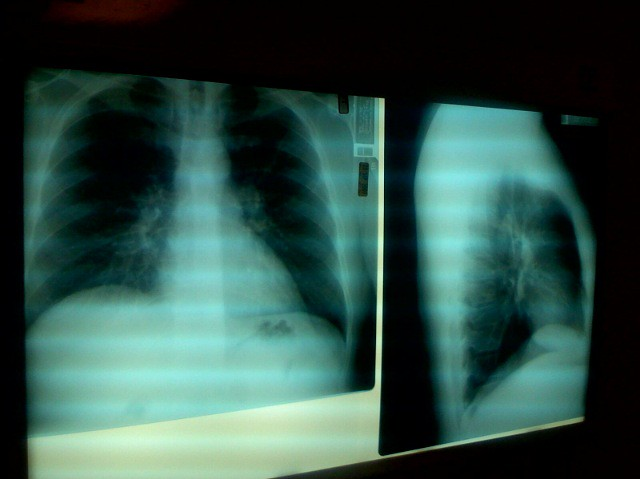

# Chest x-ray classification
This is a quick project where we look into x-ray images with <a href=https://data.mendeley.com/datasets/rscbjbr9sj/2> this dataset</a>.

# Contents
- Jupyter Notebook
- Images for the different visualizations
- CNN models

# Instructions
You can view the notebook also with <a href=https://nbviewer.jupyter.org/github/cydessole/Make-Money-ML-Project/blob/master/Week_04/xray.ipynb#toc3>nbviewer ! </a>
