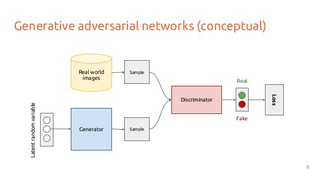

# GAN with MNIST FASHION
This is a quick project where we look into the power of generative adversarial network

source : https://medium.com/archieai/a-dozen-times-artificial-intelligence-startled-the-world-eae5005153db

# Content
- Jupyter Notebook

# Instructions
If you can't see the notebook with github, you can download it, or use <a href=https://nbviewer.jupyter.org/github/cydessole/Make-Money-ML-Project/blob/master/Week_06/GAN_MNIST.ipynb>nbviewer ! </a>
