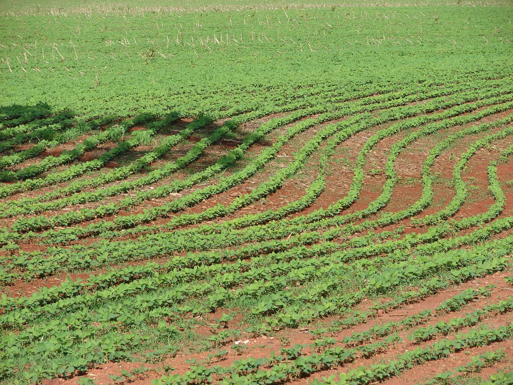

# Weed Detection in Soybean Crops
This is a quick project where we look into deep learning multi-class classification with weed Detection.

# Content
- Jupyter Notebook
- Images of results

# Instructions
If you can't see the notebook with github, you can download it, or use <a href=https://nbviewer.jupyter.org/github/cydessole/Make-Money-ML-Project/blob/master/Week_07/Weed_Detection.ipynb>nbviewer ! </a>
