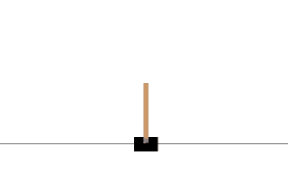

# Reinforcement learning
This is a quick project where we look into the gym library.

# Contents
- Jupyter Notebook

# Instructions
If you can't see the notebook with github, you can download it, or use <a href=https://nbviewer.jupyter.org/github/cydessole/Make-Money-ML-Project/blob/master/Week_09/DQN.ipynb>nbviewer ! </a>
